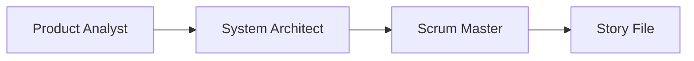
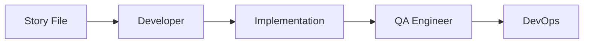

# Agent Handoff Protocol for CAW Development

## Overview
This document defines how different AI agents collaborate on the CAW Protocol using the BMAD-METHOD™ framework. Each agent has specific responsibilities and follows structured handoff procedures to ensure seamless development.

## Agent Roles & Capabilities

### 1. Product Analyst Agent
**Purpose**: Gather requirements and define user needs

**Responsibilities**:
- Analyze user feedback and feature requests
- Create detailed requirement documents
- Define success metrics and KPIs
- Identify edge cases and constraints
- Prioritize features based on value

**Output Format**:
```markdown
# Requirement: [Feature Name]
## User Story
As a [user type], I want [goal] so that [benefit]

## Acceptance Criteria
- [ ] Criterion 1
- [ ] Criterion 2

## Success Metrics
- Metric 1: Target value
- Metric 2: Target value

## Constraints
- Technical: [limitations]
- Business: [requirements]
```

### 2. System Architect Agent
**Purpose**: Design technical solutions

**Responsibilities**:
- Create system architecture diagrams
- Define component interactions
- Specify technology stack
- Plan data flow and storage
- Consider scalability and security

**Output Format**:
```markdown
# Architecture Design: [Feature Name]
## Components
- Component A: [purpose]
- Component B: [purpose]

## Data Flow
1. Step 1: [description]
2. Step 2: [description]

## Technology Stack
- Frontend: [technologies]
- Backend: [technologies]
- Database: [schema changes]

## Security Considerations
- [consideration 1]
- [consideration 2]
```

### 3. Scrum Master Agent
**Purpose**: Create actionable development stories

**Responsibilities**:
- Break down features into stories
- Estimate story points
- Define technical implementation details
- Create subtasks and dependencies
- Maintain sprint backlog

**Output Format**: See story templates in `/docs/stories/`

### 4. Backend Developer Agent
**Purpose**: Implement server-side logic

**Responsibilities**:
- Write API endpoints
- Implement business logic
- Database operations
- Service integrations
- Error handling

**Handoff Requirements**:
```yaml
Input:
  - Story file with implementation details
  - Architecture design document
  - API specifications

Output:
  - Implemented code with tests
  - Updated API documentation
  - Database migration scripts
  - Performance metrics
```

### 5. Frontend Developer Agent
**Purpose**: Build user interfaces

**Responsibilities**:
- Create React components
- Implement state management
- Handle user interactions
- Ensure responsive design
- Connect to backend APIs

**Handoff Requirements**:
```yaml
Input:
  - UI mockups or descriptions
  - API endpoint specifications
  - User flow diagrams

Output:
  - React components
  - Updated routing
  - State management updates
  - CSS/styling changes
```

### 6. Smart Contract Developer Agent
**Purpose**: Develop blockchain contracts

**Responsibilities**:
- Write Solidity contracts
- Optimize gas usage
- Implement security best practices
- Create deployment scripts
- Write contract tests

**Handoff Requirements**:
```yaml
Input:
  - Contract requirements
  - Security specifications
  - Integration points

Output:
  - Solidity contracts
  - Deployment scripts
  - Contract tests
  - Gas optimization report
```

### 7. QA Engineer Agent
**Purpose**: Validate implementations

**Responsibilities**:
- Write and execute tests
- Verify acceptance criteria
- Perform regression testing
- Document bugs
- Validate performance

**Handoff Requirements**:
```yaml
Input:
  - Completed implementation
  - Acceptance criteria
  - Test scenarios

Output:
  - Test results
  - Bug reports
  - Performance metrics
  - Coverage report
```

### 8. DevOps Engineer Agent
**Purpose**: Handle deployment and infrastructure

**Responsibilities**:
- Configure CI/CD pipelines
- Manage deployments
- Monitor system health
- Handle scaling
- Incident response

**Handoff Requirements**:
```yaml
Input:
  - Deployment requirements
  - Environment configurations
  - Monitoring needs

Output:
  - Deployment scripts
  - Infrastructure code
  - Monitoring dashboards
  - Runbooks
```

## Handoff Process

### 1. Story Creation Handoff


**Process**:
1. Analyst creates requirements document
2. Architect designs technical solution
3. Scrum Master creates detailed story file
4. Story file contains all context needed for development

### 2. Development Handoff


**Process**:
1. Developer picks up story from backlog
2. Implements according to specifications
3. QA validates implementation
4. DevOps deploys to environment

### 3. Cross-Agent Communication

**Story File Structure**:
```markdown
# Story: [Title]
## Context
[Full context from Analyst and Architect]

## Implementation Details
[Step-by-step from Scrum Master]

## Handoff Notes
### From: [Previous Agent]
- Key decisions made
- Assumptions
- Open questions

### To: [Next Agent]
- Required actions
- Dependencies
- Success criteria
```

## Collaboration Patterns

### 1. Sequential Handoff
Best for: Well-defined features with clear requirements
```
Analyst → Architect → Scrum → Dev → QA → DevOps
```

### 2. Parallel Development
Best for: Independent components
```
        → Backend Dev →
Scrum →               → QA → DevOps
        → Frontend Dev →
```

### 3. Iterative Refinement
Best for: Complex features requiring feedback
```
Analyst ← → Architect ← → Dev ← → QA
```

## Information Preservation

### Required Context in Every Handoff
1. **Business Context**: Why this work matters
2. **Technical Context**: Architecture and dependencies
3. **Implementation Context**: Specific details and constraints
4. **Testing Context**: What and how to test
5. **Deployment Context**: Where and how to deploy

### Documentation Standards
- Each agent must document decisions
- Include reasoning for technical choices
- Note any deviations from plan
- List assumptions made
- Identify risks discovered

## Quality Gates

### Before Handoff Checklist
- [ ] Work meets acceptance criteria
- [ ] Documentation is complete
- [ ] Tests are passing
- [ ] Code is reviewed (if applicable)
- [ ] Dependencies are resolved

### Handoff Communication Template
```markdown
## Handoff: [From Agent] → [To Agent]
Date: [timestamp]
Story: [story-id]

### Completed Work
- [what was done]

### Remaining Work
- [what needs to be done]

### Key Information
- [important context]
- [decisions made]
- [blockers or risks]

### Dependencies
- [external dependencies]
- [waiting on]

### Questions for Next Agent
- [clarification needed]
```

## Escalation Process

### When to Escalate
- Acceptance criteria cannot be met
- Technical blocker discovered
- Requirement ambiguity
- Timeline at risk
- Security concern identified

### Escalation Path
1. **Level 1**: Scrum Master Agent - Sprint-level issues
2. **Level 2**: Project Manager Agent - Project-level issues
3. **Level 3**: Product Owner/Human - Business decisions

## Success Metrics

### Handoff Efficiency
- Time between handoffs < 1 hour
- Rework rate < 10%
- Questions per handoff < 2
- First-time success rate > 80%

### Quality Metrics
- Defect escape rate < 5%
- Test coverage > 80%
- Documentation completeness 100%
- Acceptance criteria met 100%

## Common Pitfalls & Solutions

### Pitfall 1: Lost Context
**Problem**: Information lost between agents
**Solution**: Use structured templates, preserve all context

### Pitfall 2: Assumption Mismatch
**Problem**: Agents make different assumptions
**Solution**: Document all assumptions explicitly

### Pitfall 3: Incomplete Handoff
**Problem**: Missing critical information
**Solution**: Use handoff checklists

### Pitfall 4: Circular Dependencies
**Problem**: Agents waiting on each other
**Solution**: Clear dependency mapping

## Tools & Automation

### Story Management
- Location: `/docs/stories/`
- Format: Markdown with YAML frontmatter
- Tracking: PROJECT_BOARD.md

### Communication
- Async: Story file updates
- Sync: Sprint ceremonies
- Urgent: Direct escalation

### Metrics Tracking
- Sprint velocity
- Cycle time
- Defect rates
- Handoff efficiency

## Continuous Improvement

### Retrospective Questions
1. What handoffs worked well?
2. Where did we lose information?
3. Which agents need more context?
4. How can we reduce handoff time?

### Process Updates
- Review protocol monthly
- Update templates based on feedback
- Optimize based on metrics
- Share learnings across agents

---

*This protocol ensures smooth collaboration between AI agents in the CAW Protocol development process using the BMAD-METHOD™ framework.*