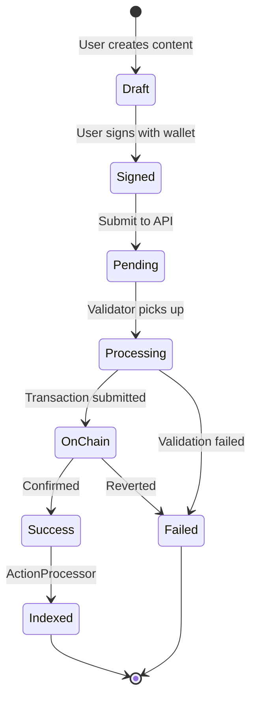

# CAW Protocol Data Flow Documentation

## Overview
This document details how data flows through the CAW Protocol system, from user action to blockchain confirmation and back to the UI.

## Table of Contents
1. [Action Lifecycle](#action-lifecycle)
2. [State Transitions](#state-transitions)
3. [Detailed Flow Diagrams](#detailed-flow-diagrams)
4. [Error Handling](#error-handling)
5. [Retry Mechanisms](#retry-mechanisms)

## Action Lifecycle

Every action in CAW Protocol follows this lifecycle:

```
USER ACTION → SIGNING → API SUBMISSION → PENDING STATE → VALIDATION → BLOCKCHAIN → CONFIRMATION → INDEXING
```

### States
- **PENDING**: Action submitted but not yet processed
- **PROCESSING**: Validator is processing the action
- **SUCCESS**: Action confirmed on blockchain
- **FAILED**: Action rejected (invalid signature, insufficient funds, etc.)

## State Transitions



## Detailed Flow Diagrams

### 1. Creating a New CAW (Post)

```
Step 1: User Composes Post
├── Enter text content
├── Add media (optional)
├── Add hashtags
└── Click "Post" button

Step 2: Frontend Processing
├── Validate content length
├── Extract hashtags
├── Generate nonce (cawonce)
├── Create EIP-712 typed data
└── Request signature from wallet

Step 3: API Submission
POST /api/actions
{
  data: {
    actionType: 0,
    senderId: 1,
    cawonce: 27,
    text: "Hello #CAW",
    amounts: [100000] // tip
  },
  signature: "0x...",
  domain: {...},
  types: {...}
}

Step 4: API Processing
├── Verify signature
├── Check nonce uniqueness
├── Store in TxQueue (status: 'pending')
├── Create Caw record (status: 'PENDING')
├── Process hashtags immediately
└── Return success response

Step 5: Optimistic UI Update
├── Add post to feed immediately
├── Show "pending" indicator
└── Enable real-time status tracking

Step 6: Validator Processing
├── Poll TxQueue every 3 seconds
├── Filter pending actions
├── Validate each action:
│   ├── Verify signature
│   ├── Check nonce
│   ├── Validate CAW cost
│   └── Simulate on-chain
├── Batch valid actions
└── Submit to blockchain

Step 7: Blockchain Processing
├── Smart contract validation
├── Store action on-chain
├── Emit Action event
└── Return transaction receipt

Step 8: Status Update
├── Update TxQueue (status: 'done')
├── Update Caw (status: 'SUCCESS')
└── Clear pending indicator in UI

Step 9: Event Processing
├── RawEventsGatherer captures event
├── Store in BlockchainEvent table
├── Publish to Redis
└── ActionProcessor indexes data

Step 10: Final State
├── Post visible to all users
├── Hashtags indexed
├── Notifications sent
└── Search index updated
```

### 2. Like Action Flow

```
User Likes Post → Sign Transaction → API Creates PendingLike
                                         ↓
                                   TxQueue Entry
                                         ↓
                                   Validator Batch
                                         ↓
                                   Blockchain Event
                                         ↓
                                   Remove PendingLike
                                         ↓
                                   Create Like Record
                                         ↓
                                   Update Like Count
```

### 3. Follow Action Flow

```
User Follows → Sign → API → TxQueue → Validator → Blockchain
                 ↓                                      ↓
          Optimistic UI                          Event Emission
                 ↓                                      ↓
          Show Following                        ActionProcessor
                                                       ↓
                                                Update Database
                                                       ↓
                                                Confirm in UI
```

## Error Handling

### Validation Errors (Immediate)
```
User Action → API Validation → ERROR
                    ↓
            Return Error Response
                    ↓
            Show Error in UI
```

Common validation errors:
- Invalid signature
- Missing required fields
- Content too long
- Invalid media URLs

### Processing Errors (Async)
```
Pending Action → Validator → Simulation Fails
                     ↓
              Mark as FAILED
                     ↓
              Update UI Status
```

Common processing errors:
- Insufficient CAW tokens
- Duplicate nonce
- Smart contract reversion
- Gas estimation failure

### Network Errors (Retry)
```
RPC Timeout → Keep as PENDING → Retry Next Cycle
                                      ↓
                              Exponential Backoff
                              (60s, 90s, 135s...)
```

## Retry Mechanisms

### 1. RPC Timeout Handling
```javascript
// Timeout Configuration
const baseTimeout = 60000; // 60 seconds
const timeout = baseTimeout * Math.pow(1.5, retryCount);

// Retry Logic
if (error.message.includes('TIMEOUT')) {
  // Keep as pending, don't mark as failed
  return { isTimeout: true };
}
```

### 2. Transaction Retry
```
Failed Transaction → Check Reason
        ↓                ↓
   Permanent Fail    Temporary Fail
        ↓                ↓
   Mark FAILED      Keep PENDING
                         ↓
                    Retry Later
```

### 3. Event Processing Retry
```
Missed Event → Gap Detection → Re-query Block Range
                                      ↓
                              Process Missing Events
```

## Data Consistency

### Ensuring Consistency
1. **Blockchain as Source of Truth**
   - All final states derived from events
   - Database is a cache/index

2. **Idempotent Operations**
   - Can safely retry without duplicates
   - Nonce prevents double-spending

3. **Status Tracking**
   ```sql
   -- Track action status
   TxQueue.status: pending → done/failed
   Caw.status: PENDING → SUCCESS/FAILED
   ```

4. **Reconciliation**
   - DataCleaner service runs every minute
   - Identifies and fixes inconsistencies
   - Removes stale pending records

## Optimization Strategies

### 1. Batching
- Validators batch multiple actions
- Reduces gas costs
- Improves throughput

### 2. Caching
- Redis caches frequently accessed data
- Reduces database load
- Improves response times

### 3. Optimistic Updates
- UI updates immediately
- Better user experience
- Rollback on failure

### 4. Parallel Processing
- Multiple validators can run
- ActionProcessor handles events in parallel
- Services scale horizontally

## Monitoring Points

Key metrics to monitor:
1. **Pending Queue Size**
   - Alert if > 100 pending actions
   - Indicates validator issues

2. **Processing Time**
   - Track time from pending to confirmed
   - Should be < 30 seconds normally

3. **Failure Rate**
   - Monitor failed transaction percentage
   - Investigate if > 5%

4. **RPC Health**
   - Track timeout frequency
   - Switch endpoints if needed

## Troubleshooting Guide

### Actions Stuck in Pending
1. Check validator is running
2. Verify RPC connectivity
3. Check wallet balance
4. Review validator logs

### Missing Events
1. Check RawEventsGatherer logs
2. Verify WebSocket connection
3. Check block range gaps
4. Run event backfill script

### Database Inconsistencies
1. Run DataCleaner manually
2. Check for race conditions
3. Verify event processing order
4. Reconcile with blockchain state

## Best Practices

1. **Always Handle Timeouts Gracefully**
   - Don't mark as failed immediately
   - Implement exponential backoff
   - Log for monitoring

2. **Validate Early and Often**
   - Client-side validation
   - API validation
   - Smart contract validation

3. **Design for Eventual Consistency**
   - Optimistic UI updates
   - Handle rollbacks gracefully
   - Show appropriate loading states

4. **Monitor and Alert**
   - Set up monitoring dashboards
   - Configure alerts for anomalies
   - Regular health checks

5. **Test Failure Scenarios**
   - Network failures
   - Invalid data
   - Race conditions
   - High load conditions